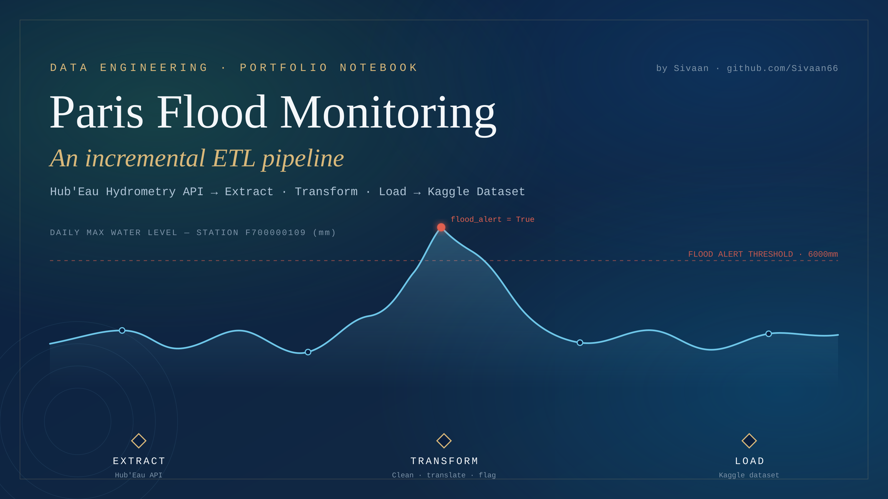

<p align="center">
  
</p>

<h1 align="center">Paris Flood Monitoring — ETL Pipeline</h1>

<p align="center">
  An incremental, mock-tested ETL pipeline that keeps a Paris hydrometric dataset current on Kaggle.<br>
  <b>Hub'Eau API</b> → Extract → Transform → Load → <b>Kaggle Dataset</b>
</p>

<p align="center">
  
  
  
  
</p>

---

## Overview

This project pulls **daily maximum water level readings** (`HIXnJ`) for five monitoring stations
around Paris from the French government's [Hub'Eau Hydrometry API](https://hubeau.eaufrance.fr/api/v2/hydrometrie/obs_elab),
cleans and standardizes the data, flags potential flood events, and publishes the result as a
versioned CSV dataset on Kaggle.

It's built as a single, well-organized Jupyter notebook — every function is prototyped and
unit-tested against a synthetic mock API before ever touching the real one, so the whole pipeline
can be developed, tested, and demoed **offline**.

| Property | Why it matters |
|---|---|
| **Incremental** | Only fetches data *after* the last date already in the dataset — no wasted API calls. |
| **Idempotent** | Deduplicates every run, so re-running never creates duplicate rows. |
| **Mock-first** | Every function is tested against a synthetic mock API before the live one. |
| **Defensive** | Missing files, bad dates, and malformed values are handled gracefully instead of crashing. |

---

## Pipeline architecture

```text
Paris Flood ETL Pipeline
│
├── ⚙️  SETUP
│   ├── Dependency imports (pandas, numpy, requests, ...)
│   └── Configuration dataclasses
│       ├── APIConfig        → Hub'Eau endpoint, metric, timeouts
│       ├── StationConfig     → station codes, flood threshold, earliest date
│       └── KaggleConfig      → dataset slug, output paths, metadata fields
│
├── 📥 EXTRACT
│   ├── load_csv()                 → safely load existing dataset (or empty frame)
│   ├── determine_date_range()     → decide if / from when new data is needed
│   ├── generate_mock_api_data()   → synthetic API responses for offline dev/testing
│   ├── signle_station_data()      → fetch (mock or real) data for one station
│   └── fetch_all_data()           → loop over every configured station
│
├── 🔄 TRANSFORM
│   ├── Type parsing               → convert_to_date / convert_to_numeric / auto_convert_columns
│   ├── Schema translation         → French ↔ English column & category maps
│   ├── Derived data               → add_derived_columns (flood_alert), order_columns
│   ├── Deduplication              → create_dedup_key, remove_duplicates
│   └── postprocess()              → orchestrates all of the above in sequence
│
├── 📤 LOAD
│   ├── create_dir()               → prepares the output directory
│   └── create_metadata()          → builds the Kaggle dataset-metadata.json content
│
└── 🚀 ORCHESTRATION
    ├── run_etl_pipeline()          → runs Extract → Transform → Load end-to-end
    ├── write_metadata()            → writes metadata JSON to disk
    ├── publish_to_kaggle()         → pushes the new dataset version via Kaggle CLI
    ├── validate_and_analyze()      → post-run data quality report
    └── main()                      → entry point for a live run
```

---

## Dataset

The published dataset contains one row per station per day:

| Column | Description |
|---|---|
| `station_code` | Hub'Eau station identifier |
| `record_date` | Date of the observation |
| `water_level_mm` | Daily maximum water level, in millimeters |
| `flood_alert` | `True` if `water_level_mm` exceeds the configured threshold |
| `validation_status` | Data validation status (validated / provisional / raw) |
| `quality` | Quality assessment of the reading |
| `production_method` | How the measurement was produced |
| `latitude`, `longitude` | Station coordinates |

Source: [Hub'Eau Hydrometry API](https://hubeau.eaufrance.fr/api/v2/hydrometrie/obs_elab) ·
Published to: [Kaggle](https://www.kaggle.com/datasets/grimespoint/paris-flood-dataset)

---

## Getting started

### Requirements

```bash
pip install pandas numpy requests kaggle
```

A [Kaggle API token](https://www.kaggle.com/docs/api) (`kaggle.json`) is required only for the live
publish step — everything else runs fully offline against the built-in mock API.

### Run it

1. Open `Sivaan_ETL_Pipeline_Clean.ipynb` in Jupyter or VS Code.
2. Run all cells top to bottom. Sections 1–4 build and unit-test every pipeline function against
   mock data — nothing is written or published during this phase.
3. Section 5 (**Orchestration**) assembles everything and, when run via `main()`, executes a real
   pipeline run: fetching live data, writing the CSV, generating metadata, and publishing to Kaggle.

To adapt this pipeline to your own dataset, update `KaggleConfig` (dataset slug, paths, metadata
fields) and `StationConfig` (station codes, flood threshold) near the top of the notebook.

---

## Project structure

```text
.
├── Sivaan_ETL_Pipeline_Clean.ipynb   # the full ETL pipeline, documented cell by cell
├── cover_image.png / cover_image.svg # notebook / repo cover art
└── README.md
```

---

## Author

**Sivaan** — [github.com/Sivaan66](https://github.com/Sivaan66)

## License

MIT — feel free to fork and adapt for your own hydrometry or environmental monitoring datasets.